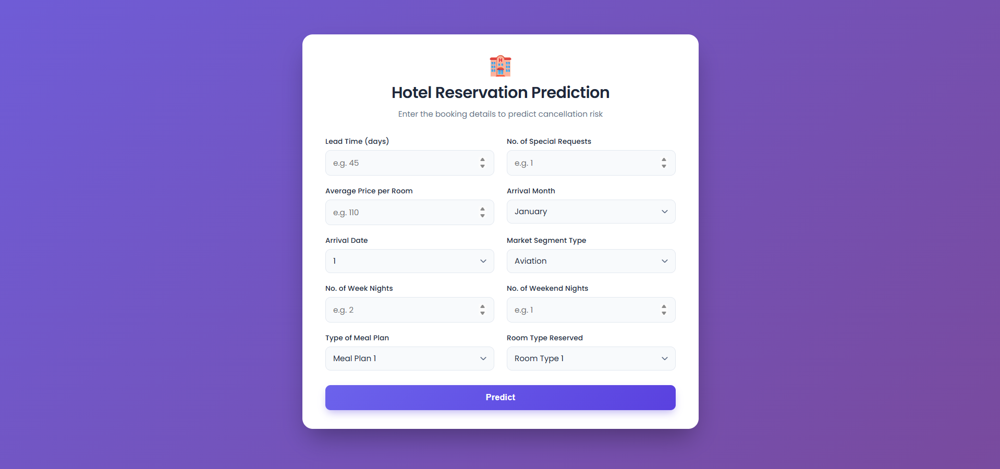

# 🏨 Hotel Reservation Prediction

An end-to-end MLOps project that predicts whether a hotel booking will be **canceled** or **honored**, based on booking details such as lead time, room type, meal plan, and price. The project covers the full lifecycle: data ingestion, preprocessing, model training with experiment tracking, a Flask web app for inference, and a CI/CD pipeline that builds, containerizes, and deploys the app to Google Cloud Run.

## ✨ Features

- 📥 **Data ingestion** from a local file or a GCP Cloud Storage bucket, with an automatic train/test split.
- 🧹 **Data preprocessing**: duplicate removal, label encoding of categorical columns, skewness correction, SMOTE-based class balancing, and Random Forest–based feature selection.
- 🧠 **Model training** using LightGBM with hyperparameter tuning via `RandomizedSearchCV`.
- 📊 **Experiment tracking** with MLflow (datasets, parameters, metrics, and the trained model are logged as artifacts).
- 🌐 **Web app** built with Flask for interactive cancellation predictions.
- 🐳 **Containerized deployment** via Docker, with a Jenkins pipeline that builds the image and deploys it to Google Cloud Run.

## 🖼️ Screenshots

### Web App UI



## 📁 Project Structure

```
.
├── application.py              # Flask app for serving predictions
├── config/
│   ├── config.yaml             # Data source, ingestion, and preprocessing config
│   ├── model_params.py         # LightGBM hyperparameter search space
│   └── paths_config.py         # Centralized file/artifact paths
├── src/
│   ├── data_ingestion.py       # Downloads/copies raw data and splits train/test
│   ├── data_preprocessing.py   # Cleaning, encoding, balancing, feature selection
│   ├── model_training.py       # Model training, evaluation, and MLflow logging
│   ├── logger.py                # Centralized logging setup
│   └── custom_exception.py     # Custom exception wrapper
├── pipeline/
│   └── training_pipeline.py    # Orchestrates ingestion → preprocessing → training
├── utils/
│   └── common_functions.py     # Shared helpers (e.g., YAML/data loading)
├── templates/index.html        # Web UI for the Flask app
├── static/style.css            # Web UI styling
├── DATASET/                    # Local copy of the raw dataset
├── artifacts/                  # Generated raw/processed data and trained models
├── notebook/notebook.ipynb     # Exploratory data analysis
├── Dockerfile                  # Container image definition
├── Jenkinsfile                 # CI/CD pipeline (build → push to GCR → deploy to Cloud Run)
└── requirements.txt / setup.py # Dependencies and packaging
```

## 🗃️ Dataset

The dataset (`DATASET/Hotel Reservations.csv`) is sourced from Kaggle — see `DATASET/KAGGLE LINK.txt` for the original link. Each row represents a hotel booking with features like number of adults/children, stay duration, meal plan, room type, lead time, market segment, and the target `booking_status` (canceled or not canceled).

## 🚀 Getting Started

### ✅ Prerequisites

- Python 3.12
- pip

### 📦 Installation

```bash
pip install -e .
```

This installs all dependencies listed in `requirements.txt`, including `pandas`, `scikit-learn`, `lightgbm`, `imbalanced-learn`, `mlflow`, `flask`, and `google-cloud-storage`.

### ⚙️ Configuration

Edit `config/config.yaml` to control the pipeline:

- `data_source.env`: `local` to read the dataset from `DATASET/`, or `gcp` to pull it from a Cloud Storage bucket (configure `bucket_name` and `bucket_file_name`).
- `data_ingestion.train_ratio`: train/test split ratio.
- `data_processing`: categorical/numerical columns, skewness threshold, and number of features to keep after feature selection.

### 🏋️ Run the Training Pipeline

```bash
python pipeline/training_pipeline.py
```

This runs data ingestion, preprocessing, and model training in sequence, saving the trained model to `artifacts/models/lgbm_model.pkl` and logging the run to MLflow (backed by `mlflow.db`).

To inspect experiment runs:

```bash
mlflow ui --backend-store-uri sqlite:///mlflow.db
```

### 🌐 Run the Web App

```bash
python application.py
```

The app starts on `http://0.0.0.0:8080`. Fill in the booking details in the form to get a cancellation prediction.

## 🐳 Docker

Build and run the containerized app (the image trains the model during build, then serves the Flask app):

```bash
docker build -t hotel-reservation-prediction .
docker run -p 5000:5000 hotel-reservation-prediction
```

## 🔄 CI/CD

The `Jenkinsfile` defines a pipeline that:

1. Clones the repository.
2. Sets up a virtual environment and installs dependencies.
3. Builds a Docker image and pushes it to Google Container Registry (GCR).
4. Deploys the image to Google Cloud Run.

For the detailed setup and step-by-step walkthrough, see [CI CD STEPS.md](CI%20CD%20STEPS.md).

## 🛠️ Tech Stack

- Python
- Flask
- LightGBM
- scikit-learn
- imbalanced-learn (SMOTE)
- MLflow
- Docker
- Jenkins 
- Google Cloud Platform (Cloud Storage, Cloud Run, GCR)
